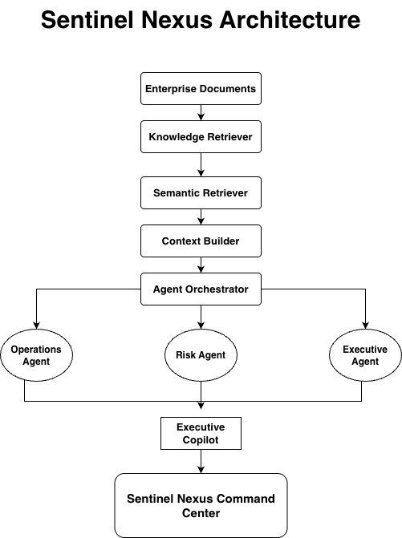
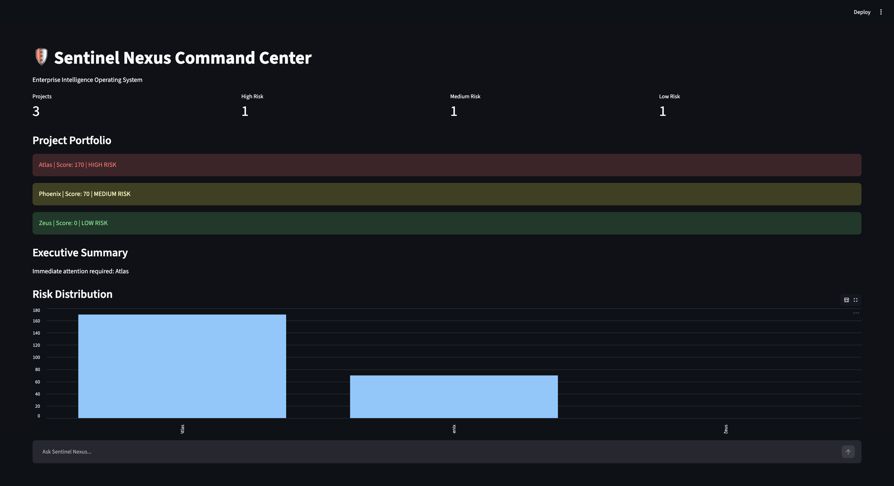
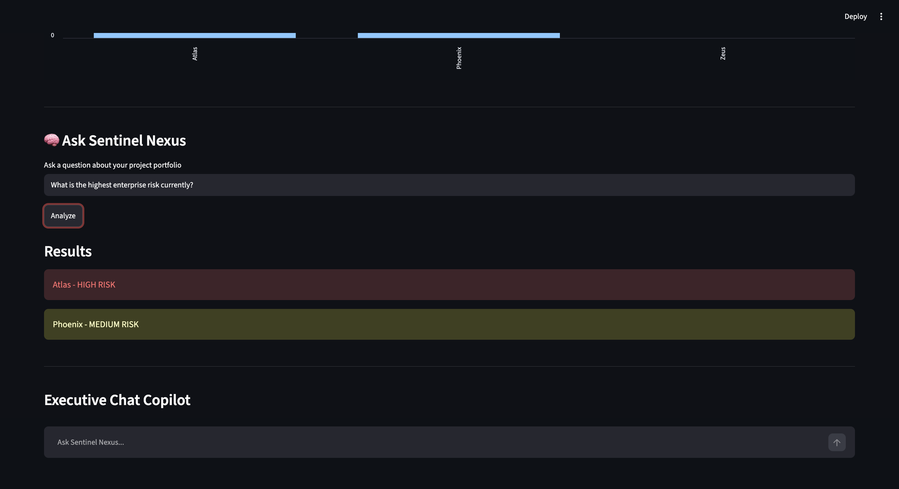
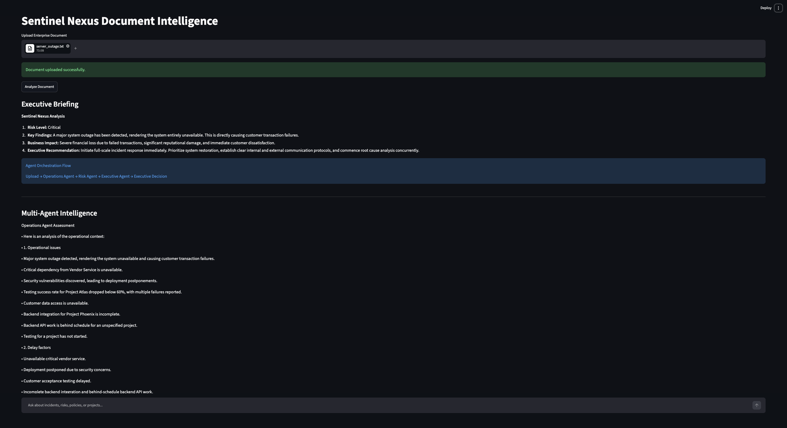
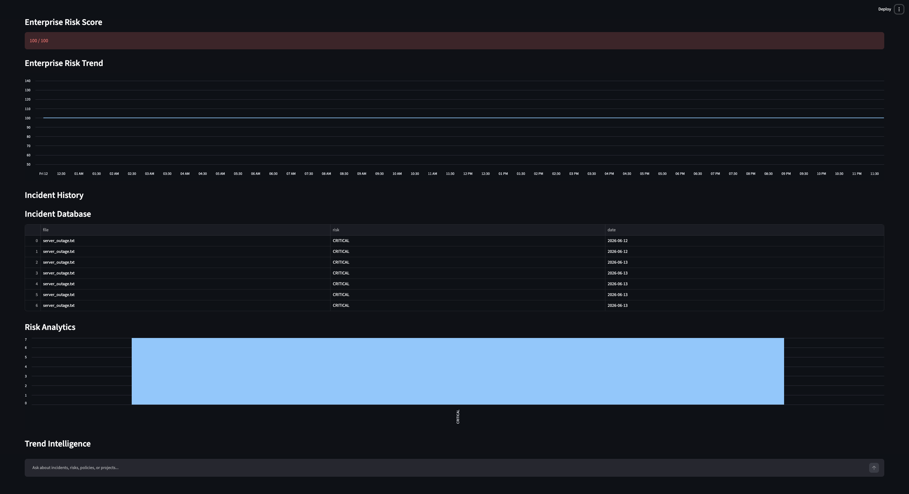

# Sentinel Nexus

Enterprise Multi-Agent Intelligence Platform

Sentinel Nexus is an AI-powered enterprise decision intelligence system that transforms operational data, incident reports, project updates, and enterprise documents into actionable executive insights.

---

## Problem

Enterprise leaders often receive information from disconnected sources:

- Incident reports
- Security alerts
- Project updates
- Meeting notes
- Operational dashboards

Critical risks are often discovered too late.

Sentinel Nexus continuously analyzes enterprise intelligence and surfaces actionable recommendations before risks escalate.

---

## Features

### Multi-Agent Architecture

- Operations Agent
- Risk Agent
- Executive Agent

### Executive Copilot

Ask natural language questions about:

- Incidents
- Risks
- Projects
- Policies

### Document Intelligence

Upload enterprise documents and automatically generate:

- Risk assessments
- Executive briefings
- Action plans

### Enterprise Analytics

- Risk Scoring
- Trend Analysis
- Predictive Intelligence
- Incident Tracking

---

## Microsoft IQ Integration

Sentinel Nexus implements a Foundry IQ-inspired grounded retrieval layer.

Components:

- Knowledge Retriever
- Semantic Retriever
- Context Builder

These modules retrieve enterprise documents, construct contextual knowledge, and provide grounded information before executive decision generation.

This reduces hallucinations and improves enterprise reasoning.

---

## Architecture

---

## Screenshots

### Command Center Dashboard

### Executive Chat Copilot

### Document Intelligence Analysis

### Risk Analytics Dashboard

---

## Technology Stack

- Python
- Streamlit
- Google Gemini
- Multi-Agent Architecture
- RAG-style Retrieval
- GitHub

---

## Installation

pip install -r requirements.txt

streamlit run dashboard.py

streamlit run dashboard_upload.py

---

## Future Enhancements

- Microsoft Fabric Integration
- Microsoft Foundry Integration
- Real-time Enterprise Monitoring
- Knowledge Graph Support
